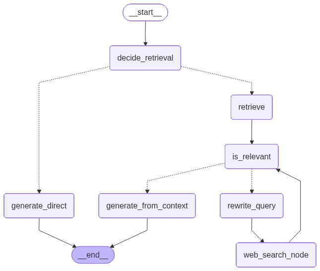

# NeoStats Presentation Deck

Use this as the content for a short and impactful PPT.

---

## Slide 1: Title

**NeoStats: Adaptive RAG Chatbot**

- AI Engineer Use Case Submission
- Document-aware chatbot with web fallback
- Built using Streamlit, LangGraph, FAISS, and Tavily

Presenter:
- Gaurav

GitHub:
- https://github.com/iota765/NeoStats

---

## Slide 2: Use Case Objective

**Objective**

- Build an intelligent chatbot that answers using uploaded documents first
- Fall back to live web search when local context is missing
- Avoid hallucinations by answering only when proper evidence exists

**Problem Being Solved**

- Generic chatbots often guess factual answers
- Users need a system that can retrieve, verify, and abstain when unsure

---

## Slide 3: How I Approached the Problem

**Approach**

- Started from the provided chatbot template
- Designed an adaptive workflow instead of a fixed one-shot pipeline
- Split the system into modular components for UI, retrieval, routing, prompts, and helpers

**Reasoning**

- Some questions can be answered directly
- Some require uploaded document retrieval
- Some require real-time web verification

---

## Slide 4: Solution Architecture

**Architecture Flow**

1. User asks a question
2. System decides whether retrieval is required
3. Uploaded documents are chunked, embedded, and searched
4. Retrieved content is filtered for relevance
5. If local context is weak, the query is rewritten and sent to web search
6. Final answer is generated only from valid context
7. If no reliable context exists, the chatbot returns:  
   `I don't know based on the available information.`

**Graph Architecture**



---

## Slide 5: Features Implemented

**Core Features**

- Local document upload for `pdf` and `txt`
- RAG with embeddings and FAISS vector search
- Live web search fallback using Tavily
- Concise and Detailed response modes
- Terminal-based debugging for every major step

**Quality Features**

- Strict routing for factual and entity-based questions
- Relevance filtering before answer generation
- Abstains instead of guessing when evidence is missing

---

## Slide 6: Challenges Faced

**Challenges**

- The model sometimes hallucinated factual answers
- The relevance filter could discard useful chunks
- Early routing sometimes stopped before web search
- Project structure had to be aligned with the assignment requirement

**How I Solved Them**

- Added strict verification-oriented routing
- Improved retrieval depth and fallback logic
- Enabled direct-to-web fallback when the model says it does not know
- Reorganized the repository to match the requested structure

---

## Slide 7: Final Outcome

**What the Solution Delivers**

- Answers grounded in uploaded documents when available
- Falls back to web search for missing factual information
- Refuses to invent unsupported answers
- Provides a cleaner and more submission-ready project structure

**Impact**

- More trustworthy responses
- Better debugging visibility
- Stronger fit for business research and knowledge-assistant use cases

---

## Slide 8: Deployment and Links

**Project Repository**

- GitHub: https://github.com/iota765/NeoStats

**Deployment Link**

- Streamlit: `[Add your Streamlit deployment URL here]`

**Run Locally**

```bash
python -m streamlit run app.py
```

---

## Optional Final Verbal Close

**Closing Line**

This project demonstrates how an adaptive RAG system can make chatbot responses more useful, more grounded, and more trustworthy than a standard LLM-only assistant.
